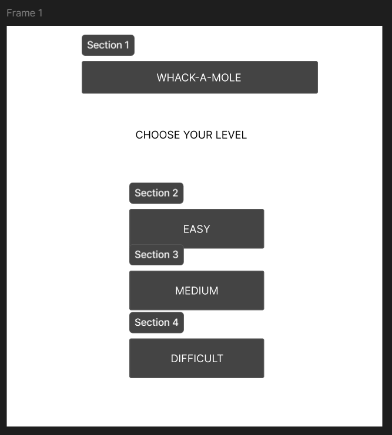
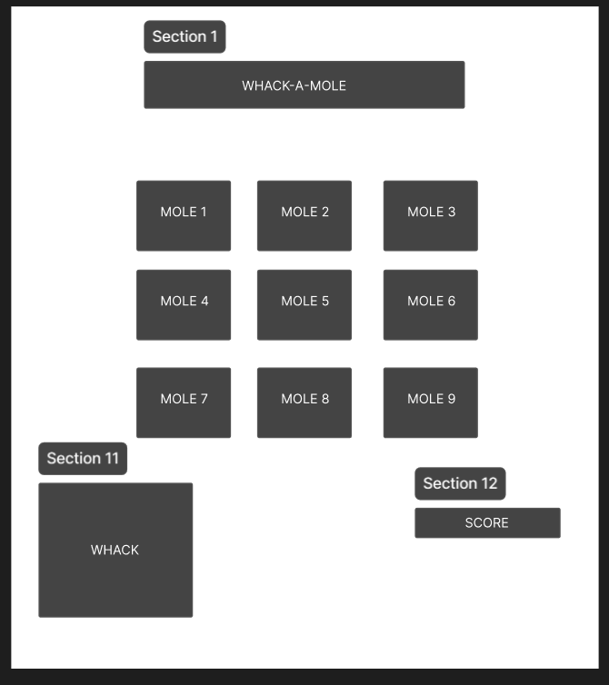

# ***MASH n SMASH***
## Date: 17/09/2025

### By: Eman Rauf
#### [GitHub](https://github.com/emannn077/whack-a-mole) | [Linkedin](https://linkedin.com/in/emanrauf77)

### ***Description***
#### MASH n SMASH is a game where the user/player will whack any character coming out of the mole. The mole will come up and then disappear. There will be game level (Easy, Medium, Difficult) depending on what the player/user wants. Then the game will have timer according to the level itself. There will be scoring system as well.

### ***Technologies Used***
* HTML
* CSS
* JavaScript
* Figma
* Github
* VS code

### ***Wireframes***
##### Wire Frame 1

##### Wire Frame 2

### ***Future Update***
- [ ] Pop up score on images

#### Credits:
##### https://www.101soundboards.com/
##### https://www.w3schools.com/js/js_timing.asp
##### https://www.reddit.com/r/learnjavascript/comments/ql9yes/how_to_set_up_a_timer_in_javascript/
